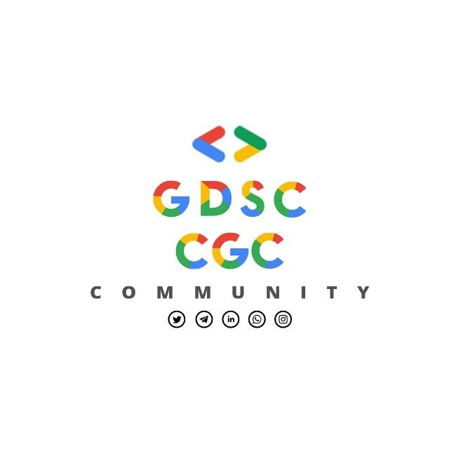

# Hacktoberfest-Marathon-Welcome


<div align="center">
 Open source is changing the world – one contribution at a time.<br><br>
 <strong>Support open source throughout October!</strong><br>
 Hacktoberfest encourages participation in the open source community, which grows bigger every year. Complete the 2021 challenge and earn a limited edition T-shirt. 
</div>

## Contents
- [Hacktoberfest](#hacktoberfest-rocket)
- [Our Tracks](#our-tracks-sparkles)
- [Steps to Contribtue](#steps-to-contribtue-octocat)
- [Connect with the Community](#connect-with-the-community-rocket)

## Hacktoberfest :rocket:
### What is Hacktoberfest?
[Hacktoberfest](https://hacktoberfest.digitalocean.com/), in its 8th year, is a month-long celebration of open source software run by [DigitalOcean](https://www.digitalocean.com/). During the month of October, we invite you to join open-source software enthusiasts, beginners, and the developer community by contributing to open-source projects. You can do this in a variety of ways:
- Prepare and share your project for collaboration
- Contribute to the betterment of a project via pull requests
- Organize an event
- Mentor others
- Donate directly to open source projects

### How to Participate
As a participant, whether a beginner or experienced, you have an opportunity to learn about open source and contribute to open source projects. Open-source projects keep the internet humming—but they can’t do it without resources. Donate and support their awesome work.   

In order to participate, you need to sign in on the [Hacktoberfest Website](https://hacktoberfest.digitalocean.com/) using your GitHub account. All the pull requests that you initiate will be tracked through this portal. You can sign up anytime between October 1 and October 31. Just be sure to sign up on the official Hacktoberfest website for your pull requests to count.

Once registered, you need to contribute to open source projects which are participating in the fest. Pull requests can be made in any participating GitHub or GitLab hosted repository/projects. Look for the 'hacktoberfest' topic to know if a project is participating in Hacktoberfest. 

A pull request is considered approved once it has an overall approving review from maintainers, or has been merged by maintainers, or has been given the 'hacktoberfest-accepted' label.

Participants with at least 4 accepted pull requests will receive rewards from digitalocean. Rather than receive t-shirts as swag, you can choose to have a tree planted in your name and help make Hacktoberfest 2021 more carbon neutral. 

### Rules
- The pull request must contain commits you made yourself.
- If a maintainer reports your pull request as spam, it will not be counted toward your participation in Hacktoberfest.
- If a maintainer reports behavior that’s not in line with the project’s code of conduct, you will be ineligible to participate.

## Our Tracks :sparkles:
S. No. | Track | Repository Link | Developed By
--- | --- | --- | ---
1 | ReactJS | [https://github.com/GDSC-CGC/Start-ReactJS](https://github.com/GDSC-CGC/Start-ReactJS) | GDSC CGC
2 | C++ | [https://github.com/GDSC-CGC/Start-CPP](https://github.com/GDSC-CGC/Start-CPP) | GDSC CGC
3 | JavaScript | [https://github.com/GDSC-CGC/Start-Javascript](https://github.com/GDSC-CGC/Start-Javascript) | GDSC CGC
4 | Kotlin | [https://github.com/GDSC-CGC/Start-Kotlin](https://github.com/GDSC-CGC/Start-Kotlin) | GDSC CGC
5 | OpenCV-Python | [https://github.com/GDSC-CGC/Start-OpenCV-Python](https://github.com/GDSC-CGC/Start-OpenCV-Python) | GDSC CGC

## Steps to Contribtue :octocat:
- Fork the repository of the track you are willing to follow using the fork button on the top right of the repository page. This will create a new repository under your profile containing all the content from this track. You can change the code on your forked repository and send a pull request for it to be merged with our track repository.  

- Copy the URL of the forked repository which should be under your account.
- Clone the repository on your local machine for editing the content and adding your submission using the following command:  
  ```
  git clone [Copied URL]
  ```
- Open the `Submissions` folder and create a subfolder named after your university rollnumber and add your submission files for the task to this folder.
- In order to save the changes make and add them to your GitHub repository, open a terminal window (Command Line / Powershell / Terminal / Git Bash / etc). Make sure that your command shell is inside the project folder or use the `cd` command to change the working directory such as:  
  ```
  cd Start-ReactJS/
  ```
- Confirm the folder/files you want to add or change using the command:  
  ```
  git status
  ```
- Add the changes to your staging area. This includes the files you want to make permanent with the next commit. In order to add all the files marked in the result of the last command, use the following command:  
  ```
  git add .
  ```
- Commit the changes to your staging area using the following command:  
  ```
  git commit -m "You commit message"
  ```
- Now that you have made your changes permanent, you need to push the changes to your forked repository on GitHub. Push the changes to your remote repository using the following command:  
  ```
  git push
  ```
- Refresh your repository page on your GitHub profile to confirm that your changes have been saved and uploaded to your forked repository.
- In order to make a submission, with the changes you have just committed and pushed to your repository, under the `Contribute` dropdown button click `Open pull request`.  

- Confirm the changes you want to submit and click `Create pull request`.  

- Add a title and any additional comment to your pull request and click on `Create pull request`.  

- Follow up if asked to making any changes to your pull request and adding any additional commits.

## Connect with the Community :rocket:
<div align="center">
  
  <br><br>
  <a href="https://twitter.com/dsccgc" target="_blank"></a>&emsp;
  <a href="https://t.me/dsccgc"></a>&emsp;
  <a href="https://www.linkedin.com/company/dsccgc/"></a>&emsp;
  <a href="https://bit.ly/GDSC-CGC-Community2"></a>&emsp;
  <a href="https://www.instagram.com/gdsccgc/"></a>
</div>
